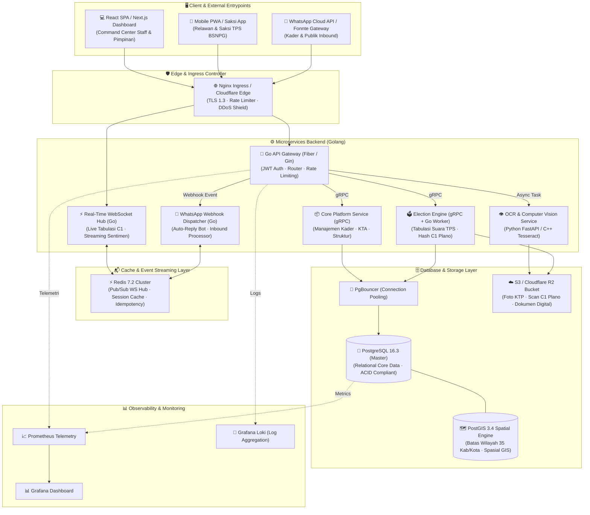

# 🟡 GOLKAR JATENG — YOUTH & DIGITAL COMMAND CENTER
> **Pusat Komando Intelijen Politik, Manajemen Pemuda & Relawan, WebGIS 35 Kab/Kota, Tabulasi C1 Plano, dan Gateway WhatsApp Webhook DPD I Partai Golkar Jawa Tengah.**

[](https://golang.org)
[](https://react.dev)
[](https://www.postgresql.org)
[](https://postgis.net)
[](https://redis.io)
[](https://grpc.io)
[](https://www.docker.com)
[](https://kubernetes.io)

---

## 📌 Daftar Isi
1. [Ringkasan Sistem](#-ringkasan-sistem)
2. [Diagram Arsitektur Sistem](#-diagram-arsitektur-sistem)
3. [Spesifikasi Rencana Tech Stack](#-spesifikasi-rencana-tech-stack)
   - [Frontend Architecture](#1-frontend-architecture)
   - [Backend Microservices & Socket (Golang)](#2-backend-microservices--real-time-socket-golang)
   - [Database & Storage Layer](#3-database--storage-layer)
   - [DevOps, Container & Kubernetes Orchestration](#4-devops-container--kubernetes-orchestration)
4. [Modul Utama Platform](#-modul-utama-platform)
5. [Struktur Repositori](#-struktur-repositori)
6. [Panduan Menjalankan Sistem Secara Lokal](#-panduan-menjalankan-sistem-secara-lokal)
7. [Spesifikasi Deployment Produksi (VPS & K8s)](#-spesifikasi-deployment-produksi-vps--k8s)
8. [Keamanan & Enkripsi Data](#-keamanan--enkripsi-data)

---

## 🏛️ Ringkasan Sistem

**GolkarJateng Command Center** adalah platform enterprise modern terintegrasi yang dirancang untuk mengonsolidasikan seluruh lini pergerakan pemenangan partai di wilayah Provinsi Jawa Tengah (35 Kabupaten/Kota, 576 Kecamatan, 8.562 Desa/Kelurahan).

Platform ini menggabungkan:
* **Executive Overview & GIS:** Pemetaan geospatial interaktif suara pemilih dan potensi basis kader muda.
* **Database Pemuda & KTA Digital:** Validasi e-KTA ber-QR code anti-pemalsuan dan profiling generasi Z / milenial.
* **Sentra Saksi BSNPG & C1 Plano:** Input formulir C1 Plano berbasis mobile scanner dan tabulasi suara real-time.
* **Monitoring Isu Publik & WhatsApp Broadcast:** Analisis sentimen media sosial dan pengiriman pesan massal terarah.
* **Golkar for Developers:** Portal mandiri untuk tim IT/DevOps yang mencakup Webhook WhatsApp (Meta Cloud API), REST API, monitoring VPS host, telemetri hardware CPU/RAM/Disk, dan orkestrasi kontainer Docker.

---

## 📐 Diagram Arsitektur Sistem



---

## 🛠️ Spesifikasi Rencana Tech Stack

### 1. Frontend Architecture
* **Framework:** **React 18/19 + Vite** (Arsitektur SPA Ultra-Fast) & **Next.js 15 (App Router)** untuk portal publik e-KTA / berita (SEO & SSR).
* **Language:** TypeScript 5.x / JavaScript ES2024.
* **State Management:** **Zustand** (Global Application & Auth State) + **TanStack Query v5 (React Query)** (Server State, Auto-caching, Polling).
* **Styling & UI System:** Vanilla CSS Enterprise Architecture dengan CSS Custom Properties (`index.css`), Tailwind CSS modular utility, dan Glassmorphism surfaces.
* **Geospatial & Visualisasi Peta:** **MapLibre GL / Leaflet** dengan GeoJSON 35 Kabupaten/Kota Jawa Tengah dan clustering TPS berkinerja tinggi.
* **Charting & Visual Analytics:** Recharts / Chart.js dengan akselerasi rendering hardware.
* **Icons:** Lucide React Enterprise Pack.
* **Real-Time Client:** Native WebSocket & Socket.io Client dengan mekanisme auto-reconnect exponential backoff.

---

### 2. Backend Microservices & Real-Time Socket (Golang)
* **Core Language:** **Golang (v1.22+)** — dipilih karena konkurensi goroutine yang sangat ringan, konsumsi memori hemat, dan latensi komputasi sangat rendah untuk mengawal ribuan saksi TPS secara bersamaan.
* **REST & Web Framework:** 
  * **Go Fiber v3** (berbasis `fasthttp`) atau **Gin Gonic v1.10** untuk implementasi HTTP API Gateway berkecepatan tinggi.
* **Real-Time Socket Architecture:**
  * **Fiber WebSocket / Gorilla WebSocket** dengan distributed broadcasting memanfaatkan Redis Pub/Sub.
  * Fitur socket: Live feed tabulasi C1 Plano suara per-kabupaten, notifikasi insiden lapangan seketika, dan update metrik sosial media.
* **Inter-Service Communication (RPC):**
  * **gRPC + Protocol Buffers v3 (`.proto`)**: Komunikasi biner terenkripsi antar-microservice (API Gateway ➔ Tabulation Engine ➔ OCR Worker) untuk memangkas serialisasi JSON hingga 80%.
* **WhatsApp Gateway Consumer:**
  * Handshake endpoint GET verifikasi `hub.verify_token`.
  * Inbound webhook listener POST untuk pesan teks, kiriman dokumen/foto C1 dari WhatsApp Cloud API & Fonnte/Wablas.
  * Auto-reply bot dispatcher yang memproses kata kunci: `KTA`, `C1`, `DAFTAR`, `AGENDA`.

---

### 3. Database & Storage Layer
* **Primary Relational Database:** **PostgreSQL 16.3**
  * ACID-Compliant untuk integritas data pemilu dan keanggotaan kader.
  * Partisi tabel harian/bulanan pada `tbl_audit_security_logs` dan `tbl_inbound_webhook_events`.
* **Geospatial Engine:** **PostGIS 3.4 Extension**
  * Menyimpan dan memproses batas poligon wilayah (Dapil, Kab/Kota, Kecamatan, TPS).
  * Indeks spasial `GIST` untuk query titik koordinat GPS saksi dan pemetaan zonasi suara.
* **Connection Pooling:** **PgBouncer 1.22**
  * Mengatur ribuan koneksi paralel dari microservices Go agar PostgreSQL tetap stabil pada pool efisien (default max 150 pool).
* **In-Memory Cache & Message Broker:** **Redis 7.2 (Alpine)**
  * Caching query database (Buffer hit ratio target >99%).
  * Rate limiter per IP / NIK kader.
  * Idempotency token untuk mencegah duplikasi pengiriman pesan webhook.
  * Background task queue untuk worker pengolah foto C1 dan broadcast blast.
* **Object Storage:** **S3-Compatible Cloudflare R2 / AWS S3 SGP1**
  * Penyimpanan foto identitas KTP (dienkripsi AES-256 at rest) dan arsip fisik formulir C1 Plano beresolusi tinggi.

---

### 4. DevOps, Container & Kubernetes Orchestration

#### A. Containerization (Docker)
* **Multi-Stage Builds:** Image Docker berbasis `scratch` atau `alpine:3.20` menghasilkan binary Go berukuran kurang dari 25 MB dengan footprint memori minimal.
* **Docker Compose v2:** Orkestrasi 6 kontainer utama untuk pengujian lokal dan deployment single-node VPS:
  1. `golkar-api-gateway` (Go REST/WS Gateway)
  2. `golkar-db-postgres` (PostgreSQL 16 + PostGIS)
  3. `golkar-cache-redis` (Redis 7.2)
  4. `golkar-ocr-c1` (Python FastAPI + OCR Engine)
  5. `golkar-nginx-proxy` (Nginx TLS 1.3 Reverse Proxy)
  6. `golkar-wa-dispatcher` (Background Queue Worker)

#### B. Kubernetes (K8s Cluster)
* **Cluster Environment:** Managed Kubernetes (GKE / Biznet K8s / K3s Bare-Metal Multi-Node).
* **Ingress Controller:** **NGINX Ingress Controller / Traefik** dengan integrasi `cert-manager` (Let's Encrypt Wildcard SSL otomatis).
* **Auto-Scaling (HPA):**
  * **Horizontal Pod Autoscaler:** Skala otomatis pod Go API Gateway dari 3 replika hingga 30 replika saat beban lonjakan data masuk hari pemilihan (C1 rush hour).
  * CPU threshold target: 70%, Memory threshold: 80%.
* **Konfigurasi Lingkungan:** `ConfigMap` dan `SealedSecrets` terenkripsi di GitOps repo.
* **Continuous Delivery (GitOps):** **ArgoCD** yang menyinkronkan status manifest Kubernetes secara otomatis dari branch `main` / `production`.

#### C. Observability & Telemetry
* **Prometheus:** Mengumpulkan metrik sistem, status CPU/RAM VPS, latency API Go, dan pool PostgreSQL.
* **Grafana:** Dashboard terpusat pemantauan kesehatan infrastruktur dan SLA 99.98%.
* **Grafana Loki & Promtail:** Sentralisasi log kontainer stdout/stderr real-time.

---

## 🚀 Modul Utama Platform

| Modul | Deskripsi Fungsional |
|---|---|
| **Executive Overview** | Dashboard ringkasan eksekutif DPD I: total pemilih, sebaran KTA, kesiapan saksi TPS, dan indeks kemenangan. |
| **WebGIS Jawa Tengah** | Peta interaktif 35 Kab/Kota berbasis spasial dengan filter Dapil RI, Provinsi, dan visualisasi densitas kader. |
| **Database Pemuda & KTA** | Pencatatan 384.000+ basis pemuda, scanner KTP otomatis, penerbitan e-KTA digital ber-QR Code resmi. |
| **Saksi TPS & C1 Plano** | Manajemen penugasan saksi BSNPG per-TPS, verifikasi dokumen C1 Plano, dan validasi tabulasi suara. |
| **Monitoring Isu Publik** | Pantauan sentimen publik medsos, radar percakapan regional Jateng, dan manajemen kampanye broadcast WA. |
| **Kelola Akses Pengguna** | Role-Based Access Control (RBAC) dengan 5 peran: *Super Admin, Pengurus DPD I, BSNPG, Admin Dapil, Staf Humas*. |
| **Golkar for Developers** | Portal terdedikasi tim IT: WhatsApp Webhook Gateway, REST API docs, VPS CPU/RAM hardware monitor, dan Docker manager. |
| **Audit Trail & Keamanan** | Pencatatan jejak audit aktivitas pengguna, proteksi sesi ganda, dan enkripsi data sesuai standar kepemiluan. |

---

## 📂 Struktur Repositori

```text
GolkarJateng/
├── api/
│   └── whatsapp-webhook.js        # Vercel Serverless Webhook Handler (GET & POST)
├── public/
│   ├── favicon.ico                # Favicon Beringin Golkar resmi
│   ├── favicon.png                # Favicon PNG High-Res
│   ├── favicon.svg                # Favicon SVG Vector
│   └── Logo_Golkar.webp           # Asset Lambang Resmi Partai Golkar
├── src/
│   ├── assets/                    # Asset gambar, poster login, dan logo
│   ├── components/                # Modul Antarmuka React
│   │   ├── AccountProfileModal.jsx
│   │   ├── AuditAndSecurityModule.jsx
│   │   ├── BoardActivityModule.jsx
│   │   ├── C1ScannerModal.jsx
│   │   ├── CommandCenterDashboard.jsx
│   │   ├── ContributorLeaderboardModule.jsx
│   │   ├── EventManagementModule.jsx
│   │   ├── ExecutiveReportsModule.jsx
│   │   ├── ExportModal.jsx
│   │   ├── FieldOperationsModule.jsx
│   │   ├── GolkarDevelopersModule.jsx  # Portal Developer, VPS & Container Monitor
│   │   ├── Header.jsx
│   │   ├── KtaManagementModule.jsx
│   │   ├── KtpScannerModal.jsx
│   │   ├── LoginPage.jsx               # Halaman Login Split Screen Modern
│   │   ├── MemberOrganizationModule.jsx
│   │   ├── QrCheckInModal.jsx
│   │   ├── Sidebar.jsx
│   │   ├── SocialMonitoringModule.jsx  # Modul Humas & Media Sosial
│   │   ├── SystemAccessModule.jsx
│   │   ├── WebGisModule.jsx
│   │   └── YouthManagementModule.jsx
│   ├── data/
│   │   └── mockData.js            # Mock dataset terintegrasi 35 Kab/Kota Jateng
│   ├── App.jsx                    # Root Application Router & Modal Controller
│   ├── index.css                  # Enterprise Design System & Utility Tokens
│   └── main.jsx                   # React DOM Entrypoint
├── docker-compose.yml             # Manifest Orkestrasi Multi-Kontainer Lokal (Roadmap)
├── index.html                     # HTML Template Ber-Favicon Resmi
├── package.json                   # Dependency Manifest & Scripts
├── vercel.json                    # Konfigurasi Routing Serverless API & SPA Rewrite
└── vite.config.js                 # Vite Bundler Configuration
```

---

## 💻 Panduan Menjalankan Sistem Secara Lokal

### Prasyarat
* **Node.js:** v18.0.0 atau lebih baru
* **npm:** v9.0.0 atau lebih baru
* **Git**

### Langkah Instalasi
1. **Clone repositori:**
   ```bash
   git clone https://github.com/dimasoktavianprasetyo/golkarjateng.git
   cd golkarjateng
   ```

2. **Checkout ke branch development:**
   ```bash
   git checkout development
   ```

3. **Install dependensi:**
   ```bash
   npm install
   ```

4. **Jalankan development server:**
   ```bash
   npm run dev
   ```
   Aplikasi akan berjalan di: `http://localhost:5173/`

5. **Build bundle produksi:**
   ```bash
   npm run build
   ```

---

## 🌐 Spesifikasi Deployment Produksi (VPS & K8s)

### 1. Spesifikasi Server Dedicated VPS (vps-prod-jateng-01)
* **Provider:** G-Core Cloud / Biznet Gio Tier-3 DC (Jakarta / Semarang Edge Point)
* **Sistem Operasi:** Ubuntu 24.04.1 LTS (Linux 6.8 x86_64)
* **Processor (CPU):** 8 vCPU AMD EPYC™ 7763 64-Core Processor @ 3.24GHz
* **Memory (RAM):** 16.0 GB DDR4 ECC Registered
* **Penyimpanan:** 250 GB Enterprise NVMe PCIe 4.0 SSD
* **Jaringan:** 10 Gbps Redundant Uplink (Public IP Statis: `103.147.221.84`)
* **Port Keamanan:** Port 80/443 (HTTP/HTTPS Nginx Proxy), Port 2284 (SSH Ed25519 Key Only)

### 2. Konfigurasi Webhook WhatsApp Resmi
* **Callback Webhook URL:** `https://golkarjateng.vercel.app/api/whatsapp-webhook`
* **Verify Token:** `GOLKAR_JATENG_WA_SECRET_2026`
* **Mode Verifikasi:** Handshake challenge kompatibel dengan Meta Developer Dashboard, Fonnte, dan Wablas.

---

## 🔒 Keamanan & Enkripsi Data

1. **Proteksi Cryptographic C1 Plano:** Setiap berkas formulir C1 Plano yang diunggah saksi di-generate nilai hash unik `SHA-256` untuk mencegah manipulasi data perolehan suara.
2. **Validasi Signature Webhook:** Verifikasi payload masuk menggunakan header `X-Hub-Signature-256` berbasis HMAC SHA-256.
3. **Transport Security:** Wajib menggunakan enkripsi **TLS 1.3** dengan sertifikat SSL Grade A+ dari Let's Encrypt / Cloudflare.
4. **Role-Based Access Control (RBAC):** Pemisahan ketat hak akses data sensitif kader, logs sistem, dan audit trail operasional.

---

<p align="center">
  <b>DEWAN PIMPINAN DAERAH I PARTAI GOLONGAN KARYA PROVINSI JAWA TENGAH</b><br>
  <i>Jl. Kyai Saleh No.1, Mugassari, Kec. Semarang Selatan, Kota Semarang, Jawa Tengah 50249</i><br>
  <sub>Suara Golkar, Suara Rakyat · Golkar Solid, Indonesia Maju</sub>
</p>
