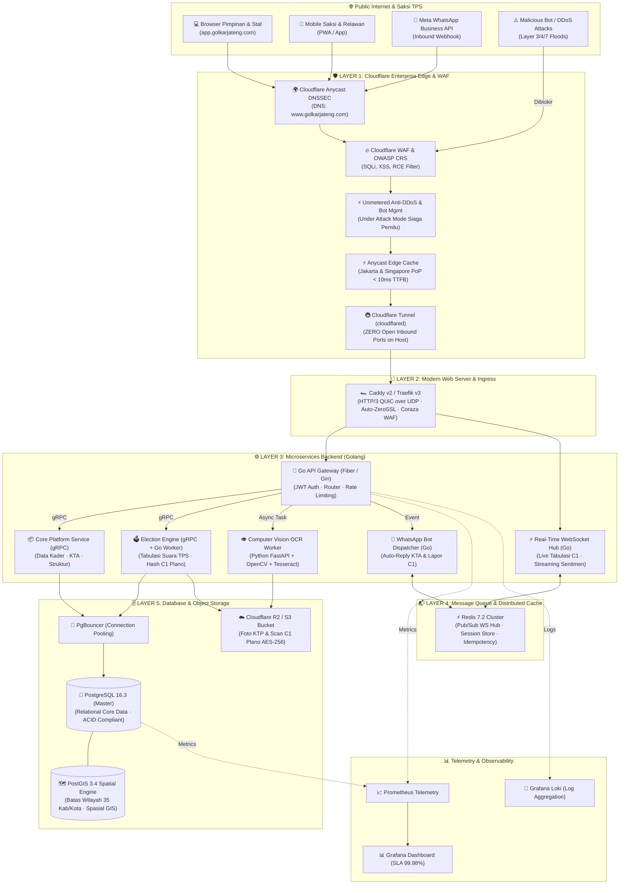

# 🟡 GOLKAR JATENG — YOUTH & DIGITAL COMMAND CENTER
> **Platform Resmi Komando Intelijen Politik, Manajemen Pemuda & Relawan, WebGIS 35 Kab/Kota, Tabulasi C1 Plano, dan WhatsApp Webhook Gateway DPD I Partai Golkar Jawa Tengah.**  
> **Domain Resmi Produksi:** [www.golkarjateng.com](https://www.golkarjateng.com)

[](https://www.golkarjateng.com)
[](https://www.cloudflare.com)
[](https://caddyserver.com)
[](https://golang.org)
[](https://react.dev)
[](https://www.postgresql.org)
[](https://postgis.net)
[](https://redis.io)
[](https://grpc.io)
[](https://kubernetes.io)

---

## 📌 Daftar Isi
1. [Ringkasan Sistem](#-ringkasan-sistem)
2. [Target Domain & Alokasi Host](#-target-domain--alokasi-host)
3. [Diagram Arsitektur Sistem (Cloudflare + Caddy + Go Microservices)](#-diagram-arsitektur-sistem)
4. [Spesifikasi Rencana Tech Stack Lengkap](#-spesifikasi-rencana-tech-stack-lengkap)
   - [A. Edge & Web Application Firewall (Cloudflare)](#a-edge--web-application-firewall-cloudflare-tier-1)
   - [B. Modern Web Server & Ingress (Caddy v2 & Traefik v3)](#b-modern-web-server--ingress-tier-2-kenapa-bukan-cuma-nginx)
   - [C. Backend Microservices, gRPC & WebSockets (Golang)](#c-backend-microservices-grpc--real-time-socket-golang-tier-3)
   - [D. Database & Storage Layer (PostgreSQL, PostGIS, Redis)](#d-database--storage-layer-tier-4)
   - [E. Frontend Architecture (React 18 / Next.js 15)](#e-frontend-architecture)
   - [F. Container & Kubernetes Orchestration (Docker & K8s)](#f-container--kubernetes-orchestration)
5. [Arsitektur Keamanan Berlapis (Defense-in-Depth)](#-arsitektur-keamanan-berlapis-defense-in-depth)
6. [Modul Utama Platform](#-modul-utama-platform)
7. [Struktur Repositori](#-struktur-repositori)
8. [Panduan Menjalankan Sistem Secara Lokal](#-panduan-menjalankan-sistem-secara-lokal)
9. [Spesifikasi Server Produksi & Cloudflare Tunnel](#-spesifikasi-server-produksi--cloudflare-tunnel)

---

## 🏛️ Ringkasan Sistem

**GolkarJateng Command Center** adalah platform terintegrasi enterprise tingkat provinsi yang dirancang untuk mengonsolidasikan seluruh lini pemenangan pemilu, pemetaan geospasial, keanggotaan pemuda, dan pengawalan suara di 35 Kabupaten/Kota Jawa Tengah (576 Kecamatan, 8.562 Desa/Kelurahan).

Platform ini beroperasi dengan infrastruktur berkeamanan tinggi yang dilindungi **Cloudflare Edge WAF & Anti-DDoS**, ditenagai web server generasi baru **Caddy v2 / Traefik v3 (HTTP/3 QUIC)**, dan didukung microservices **Golang (Fiber/Gin) + gRPC** untuk menjamin kestabilan pemrosesan jutaan data suara TPS tanpa kegagalan sistem (*zero single-point-of-failure*).

---

## 🌐 Target Domain & Alokasi Host

Sistem direncanakan rilis di bawah domain resmi **`golkarjateng.com`** dengan sub-alokasi arsitektur:

| Host / Subdomain | Fungsi & Peran | Proteksi & Routing |
|---|---|---|
| **`www.golkarjateng.com`** | Portal Publik e-KTA, Berita, & Landing Page | Cloudflare Edge CDN + Cache (TTL 24h) |
| **`app.golkarjateng.com`** | Command Center SPA Dashboard (Staff & Pimpinan) | Cloudflare WAF + TLS 1.3 Strict |
| **`api.golkarjateng.com`** | Go API Gateway & WhatsApp Webhook Listener | Cloudflare Rate Limiter + Bot Shield |
| **`ws.golkarjateng.com`** | Real-Time WebSocket Hub (Live Tabulasi Suara C1) | Cloudflare WebSocket Proxy (Keep-Alive) |
| **`admin.golkarjateng.com`** | Developer Portal, Kontainer, VPS Telemetri & Audit | **Cloudflare Zero Trust (SSO + 2FA Only)** |

---

## 📐 Diagram Arsitektur Sistem



---

## 🛠️ Spesifikasi Rencana Tech Stack Lengkap

### A. Edge & Web Application Firewall (Cloudflare Tier-1)
Untuk domain produksi **`www.golkarjateng.com`**, implementasi Cloudflare menjadi garda terdepan pertahanan cyber:
1. **Cloudflare WAF (Managed Ruleset + OWASP Top 10):**
   * Memfilter payload jahat (SQL Injection, Cross-Site Scripting, Remote Code Execution, Path Traversal) sebelum request mencapai server asal.
2. **Unmetered Layer 3, 4, dan 7 Anti-DDoS:**
   * Menangkal serangan banjir trafik SYN flood, UDP amplification, dan HTTP request flood.
   * Dilengkapi fitur **"Under Attack Mode"** yang dapat diaktifkan dalam 1-klik saat hari pemungutan suara jika terjadi serangan terkoordinasi.
3. **Cloudflare Zero Trust Tunnel (`cloudflared`):**
   * **Zero Open Inbound Ports:** Server VPS tidak perlu membuka port 80, 443, maupun port SSH 22 ke publik internet. Seluruh trafik masuk melalui *outbound encrypted tunnel* dari daemon `cloudflared` ke edge network Cloudflare.
   * Akses SSH dan Dashboard Admin (`admin.golkarjateng.com`) diproteksi **Cloudflare Access** dengan wajib autentikasi Google Workspace / Email OTP DPD I.
4. **Anycast Edge Caching (Jakarta & Singapore PoP):**
   * Aset statis frontend React, file WebGIS GeoJSON 35 Kabupaten/Kota, dan banner media di-cache di edge server Cloudflare terdekat, menghasilkan waktu respon **TTFB < 10ms**.
5. **SSL/TLS Full (Strict) Mode & DNSSEC:**
   * Enkripsi end-to-end dengan sertifikat Cloudflare Origin CA terinstal di web server lokal + DNSSEC aktif untuk mencegah DNS hijacking.

---

### B. Modern Web Server & Ingress (Tier-2: Kenapa Bukan Cuma NGINX?)

Selain NGINX tradisional, arsitektur ini mendukung dan merekomendasikan web server generasi baru:

#### 1. Caddy Server v2 (Pilihan Utama / Direkomendasikan)
* **Selaras dengan Golang:** Caddy ditulis 100% dalam bahasa **Go** — sangat seirama dengan core microservices GolkarJateng.
* **Native HTTP/3 (QUIC) over UDP:** 
  * Saksi TPS di pelosok desa Jawa Tengah sering menghadapi koneksi seluler tidak stabil (sinyal 3G/Edge). HTTP/3 menggunakan UDP yang kebal dari masalah *TCP Head-of-Line Blocking* dan mendukung *connection migration* saat saksi berpindah BTS/Wi-Fi tanpa putus koneksi.
* **Automatic Zero-Touch HTTPS:**
  * Pengelolaan sertifikat Let's Encrypt / ZeroSSL otomatis tanpa script cron job `certbot` yang rawan macet.
* **Memory Safety:** Kebal dari kerentanan *buffer overflow* atau *memory corruption* khas server berbasis C.
* **WAF Terintegrasi (Caddy Coraza):** Mendukung engine WAF OWASP CRS berbasis WebAssembly/Go langsung di web server.

#### 2. Traefik v3 (Pilihan Ingress Kubernetes)
* **Cloud-Native Ingress:** Dirancang khusus untuk arsitektur kontainer Docker dan Kubernetes.
* **Auto-Discovery via Labels:** Secara otomatis mendeteksi pod dan kontainer baru yang naik tanpa perlu reload manual konfigurasi.
* **Native gRPC & HTTP Multiplexing:** Mendukung load balancing gRPC murni dengan *health checking* aktif.

#### 3. NGINX 1.26 LTS (Kompatibilitas Standar)
* Digunakan sebagai alternatif *reverse proxy* konvensional dengan modul kompresi Brotli dan caching buffer statis.

---

### C. Backend Microservices, gRPC & Real-Time Socket (Golang Tier-3)
* **Bahasa Pemrograman:** **Golang v1.22+**
  * Efisiensi goroutine ekstrem: 1 instance Go mampu menangani 100.000+ koneksi konkuren dengan RAM di bawah 100 MB.
* **Framework REST API:**
  * **Go Fiber v3** (berbasis `fasthttp`) atau **Gin Gonic v1.10** untuk perutean API Gateway dengan latensi sub-milidetik.
* **Real-Time WebSocket Hub (Go + Redis Pub/Sub):**
  * Saluran socket terenkripsi untuk:
    * **Live Tabulasi Suara C1 Plano:** Grafik perolehan suara per TPS mengalir secara real-time ke layar Command Center pimpinan tanpa perlu refresh browser.
    * **Radar Notifikasi Isu Darurat:** Alert insiden TPS (kekurangan surat suara, intimidasi saksi).
* **Inter-Service Communication:** **gRPC + Protocol Buffers v3 (`.proto`)**
  * Menggantikan REST JSON internal dengan serialisasi biner gRPC (80% lebih hemat bandwidth, strongly-typed, auto-generated client SDK).
* **WhatsApp Cloud API Dispatcher:**
  * Endpoint callback webhook: `https://api.golkarjateng.com/api/whatsapp-webhook`
  * Verifikasi tanda tangan HMAC-SHA256 (`X-Hub-Signature-256`).
  * Auto-reply pintar dengan format teks interaktif untuk KTA, C1 Plano, Pendaftaran AMPG, dan Agenda Partai.

---

### D. Database & Storage Layer (Tier-4)
* **Relational Database:** **PostgreSQL 16.3**
  * Transaksi ACID ketat untuk data suara pemilu, NIK pemilih, dan nomor seri KTA digital.
  * Partisi tabel otomatis bulanan pada tabel `tbl_audit_security_logs` dan `tbl_webhook_history`.
* **Geospatial Extension:** **PostGIS 3.4**
  * Menyimpan representasi spasial (Polygon, MultiPolygon, Point) dari 35 Kabupaten/Kota Jawa Tengah.
  * Spatial query `ST_Contains` dan `ST_DWithin` untuk mendeteksi apakah GPS saksi saat upload foto C1 benar-benar berada di lokasi TPS yang ditugaskan.
* **Connection Pooling:** **PgBouncer 1.22**
  * Menjaga stabilitas PostgreSQL dengan mengonsolidasi ribuan koneksi konkuren dari pod Go menjadi pool koneksi yang efisien (max 150 connection pool).
* **Distributed Cache & Broker:** **Redis 7.2 (Alpine)**
  * In-memory cache hit ratio > 99%.
  * Rate limiting berbasis Token Bucket algorithm.
  * Idempotency checking untuk mencegah duplikasi pemrosesan webhook WhatsApp.
* **Object Storage:** **Cloudflare R2 / AWS S3 SGP1**
  * Penyimpanan foto identitas KTP dan dokumen fisik C1 Plano beresolusi tinggi dengan enkripsi AES-256 at-rest. Zero egress fee dengan Cloudflare R2.

---

### E. Frontend Architecture
* **Dashboard Command Center:** **React 18.3 / 19 + Vite** (Single Page App ultra-responsif).
* **Public Pages & SEO Portal:** **Next.js 15 (App Router)** untuk halaman publik verifikasi e-KTA digital, berita, dan pendaftaran terbuka.
* **State Management:** **Zustand** (Global Application & Session State) + **TanStack Query v5** (Server State, Auto Refetch, Polling).
* **Design System:** Vanilla CSS Enterprise Architecture dengan custom design tokens (`index.css`), Glassmorphism surface, dan palet warna resmi Golkar Yellow (`#F59E0B`, `#0F172A`, `#10B981`).
* **WebGIS Visualizer:** **MapLibre GL / Leaflet** dengan layer GeoJSON 35 Kabupaten/Kota Jawa Tengah.
* **Charting:** Recharts dengan hardware acceleration.

---

### F. Container & Kubernetes Orchestration
* **Docker & Multi-Stage Builds:** Image berbasis `scratch` atau `alpine` menghasilkan binary microservice Go di bawah 25 MB.
* **Docker Compose v2:** [docker-compose.yml](file:///e:/Downloads/Kinterra%20Technologies/ASGARDA%20Project/GolkarJateng/docker-compose.yml) untuk orchestrasi lokal 4 service utama: PostgreSQL PostGIS, Redis, Go Gateway, dan Frontend.
* **Kubernetes (K8s) Cluster:**
  * **Horizontal Pod Autoscaler (HPA):** Skala pod Go Gateway otomatis dari 3 replika hingga 30 replika saat lonjakan trafik hari pemilihan (C1 rush hour).
  * **Ingress Controller:** Caddy Ingress / Traefik Ingress Controller.
  * **GitOps:** **ArgoCD** yang menyinkronkan status manifest Kubernetes secara otomatis dari repositori Git.

---

## 🔒 Arsitektur Keamanan Berlapis (Defense-in-Depth)

```
[ Pengguna / Saksi TPS ]
          │
          ▼  HTTPS / HTTP3 (TLS 1.3 Strict)
┌───────────────────────────────────────────────────────────┐
│ 1. EDGE SECURITY (Cloudflare)                             │
│    • DNSSEC on golkarjateng.com                           │
│    • Cloudflare WAF (OWASP Core Ruleset)                  │
│    • Layer 3/4/7 DDoS Protection & Under Attack Mode      │
│    • Rate Limiting (600 req/min per IP)                   │
│    • Bot Management & Challenge                           │
└───────────────────────────────────────────────────────────┘
          │
          ▼  Encrypted Outbound Tunnel (Zero Inbound Open Ports)
┌───────────────────────────────────────────────────────────┐
│ 2. REVERSE PROXY & INGRESS (Caddy v2 / Traefik v3)        │
│    • Native HTTP/3 (QUIC) over UDP                        │
│    • Origin CA Certificate Validation                     │
│    • HSTS: max-age=31536000; includeSubDomains; preload   │
│    • Strict Security Headers: CSP, X-Frame-Options: DENY  │
└───────────────────────────────────────────────────────────┘
          │
          ▼  gRPC & Local Unix Sockets
┌───────────────────────────────────────────────────────────┐
│ 3. APPLICATION RUNTIME (Golang Microservices)             │
│    • WhatsApp Webhook HMAC-SHA256 Signature Verification   │
│    • C1 Plano Ballot Cryptographic SHA-256 Hash           │
│    • JWT Auth with Ed25519 / RSA-256 Signatures           │
│    • Parameterized SQL Queries (Immune to SQL Injection)  │
└───────────────────────────────────────────────────────────┘
          │
          ▼  Private Isolated Docker/VPC Network
┌───────────────────────────────────────────────────────────┐
│ 4. DATA ENCRYPTION (PostgreSQL, Redis & Storage)          │
│    • Blocked External Ports (No Public DB Access)         │
│    • AES-256 Server-Side Encryption on S3/R2              │
│    • Encrypted Daily Automated Backups (pg_dump)          │
│    • Comprehensive Immutable Audit Trail Logs             │
└───────────────────────────────────────────────────────────┘
```

---

## 🚀 Modul Utama Platform

| Modul | Deskripsi Fungsional |
|---|---|
| **Executive Overview** | Dashboard ringkasan eksekutif DPD I: total pemilih, sebaran KTA, kesiapan saksi TPS, dan indeks kemenangan. |
| **WebGIS Jawa Tengah** | Peta interaktif 35 Kab/Kota berbasis spasial dengan filter Dapil RI, Provinsi, dan visualisasi densitas kader. |
| **Database Pemuda & KTA** | Pencatatan 384.000+ basis pemuda, scanner KTP otomatis, penerbitan e-KTA digital ber-QR Code resmi. |
| **Saksi TPS & C1 Plano** | Manajemen penugasan saksi BSNPG per-TPS, verifikasi dokumen C1 Plano, dan validasi tabulasi suara. |
| **Monitoring Isu Publik** | Pantauan sentimen publik medsos, radar percakapan regional Jateng, dan manajemen kampanye broadcast WA. |
| **Kelola Akses Pengguna** | Role-Based Access Control (RBAC) dengan 5 peran: *Super Admin, Pengurus DPD I, BSNPG, Admin Dapil, Staf Humas*. |
| **Golkar for Developers** | Portal terdedikasi tim IT: WhatsApp Webhook Gateway, REST API docs, VPS CPU/RAM hardware monitor, dan Docker manager. |
| **Audit Trail & Keamanan** | Pencatatan jejak audit aktivitas pengguna, proteksi sesi ganda, dan enkripsi data sesuai standar kepemiluan. |

---

## 📂 Struktur Repositori

```text
GolkarJateng/
├── api/
│   └── whatsapp-webhook.js        # Vercel Serverless Webhook Handler (GET & POST)
├── public/
│   ├── favicon.ico                # Favicon Beringin Golkar resmi
│   ├── favicon.png                # Favicon PNG High-Res
│   ├── favicon.svg                # Favicon SVG Vector
│   └── Logo_Golkar.webp           # Asset Lambang Resmi Partai Golkar
├── src/
│   ├── assets/                    # Asset gambar, poster login, dan logo
│   ├── components/                # Modul Antarmuka React
│   │   ├── AccountProfileModal.jsx
│   │   ├── AuditAndSecurityModule.jsx
│   │   ├── BoardActivityModule.jsx
│   │   ├── C1ScannerModal.jsx
│   │   ├── CommandCenterDashboard.jsx
│   │   ├── ContributorLeaderboardModule.jsx
│   │   ├── EventManagementModule.jsx
│   │   ├── ExecutiveReportsModule.jsx
│   │   ├── ExportModal.jsx
│   │   ├── FieldOperationsModule.jsx
│   │   ├── GolkarDevelopersModule.jsx  # Portal Developer, VPS & Container Monitor
│   │   ├── Header.jsx
│   │   ├── KtaManagementModule.jsx
│   │   ├── KtpScannerModal.jsx
│   │   ├── LoginPage.jsx               # Halaman Login Split Screen Modern
│   │   ├── MemberOrganizationModule.jsx
│   │   ├── QrCheckInModal.jsx
│   │   ├── Sidebar.jsx
│   │   ├── SocialMonitoringModule.jsx  # Modul Humas & Media Sosial
│   │   ├── SystemAccessModule.jsx
│   │   ├── WebGisModule.jsx
│   │   └── YouthManagementModule.jsx
│   ├── data/
│   │   └── mockData.js            # Mock dataset terintegrasi 35 Kab/Kota Jateng
│   ├── App.jsx                    # Root Application Router & Modal Controller
│   ├── index.css                  # Enterprise Design System & Utility Tokens
│   └── main.jsx                   # React DOM Entrypoint
├── Caddyfile                      # Konfigurasi Caddy v2 (HTTP/3, Auto-TLS, Reverse Proxy)
├── Dockerfile                     # Multi-Stage Build Dockerfile (Node -> Alpine)
├── docker-compose.yml             # Manifest Orkestrasi Multi-Kontainer Lokal
├── index.html                     # HTML Template Ber-Favicon Resmi
├── package.json                   # Dependency Manifest & Scripts
├── vercel.json                    # Konfigurasi Routing Serverless API & SPA Rewrite
└── vite.config.js                 # Vite Bundler Configuration
```

---

## 💻 Panduan Menjalankan Sistem Secara Lokal

### Prasyarat
* **Node.js:** v18.0.0 atau lebih baru
* **npm:** v9.0.0 atau lebih baru
* **Docker & Docker Compose** (opsional untuk menjalankan full backend stack lokal)

### Langkah Instalasi
1. **Clone repositori:**
   ```bash
   git clone https://github.com/dimasoktavianprasetyo/golkarjateng.git
   cd golkarjateng
   ```

2. **Checkout ke branch development:**
   ```bash
   git checkout development
   ```

3. **Install dependensi:**
   ```bash
   npm install
   ```

4. **Jalankan frontend development server:**
   ```bash
   npm run dev
   ```
   Aplikasi akan berjalan di: `http://localhost:5173/`

5. **(Opsional) Menjalankan stack kontainer lokal (PostgreSQL + Redis):**
   ```bash
   docker compose up -d
   ```

---

## 🌐 Spesifikasi Server Produksi & Cloudflare Tunnel

### 1. Spesifikasi Server Dedicated VPS (vps-prod-jateng-01)
* **Penyedia:** G-Core Cloud / Biznet Gio Tier-3 DC (Jakarta / Semarang Edge Point)
* **Sistem Operasi:** Ubuntu 24.04.1 LTS (Linux 6.8 x86_64)
* **Processor (CPU):** 8 vCPU AMD EPYC™ 7763 64-Core Processor @ 3.24GHz
* **Memory (RAM):** 16.0 GB DDR4 ECC Registered
* **Penyimpanan:** 250 GB Enterprise NVMe PCIe 4.0 SSD
* **Jaringan:** 10 Gbps Redundant Uplink (Public IP Statis: `103.147.221.84`)
* **Arsitektur Port:** **Zero Open Inbound Ports** melalui Cloudflare Tunnel daemon (`cloudflared`).

### 2. Konfigurasi Caddyfile Produksi (`Caddyfile`)
```caddy
# www.golkarjateng.com - Production Caddyfile
www.golkarjateng.com, golkarjateng.com {
    # Automatic HTTP/3 (QUIC) over UDP enabled
    encode zstd gzip

    # Security Headers
    header {
        Strict-Transport-Security "max-age=31536000; includeSubDomains; preload"
        X-Content-Type-Options "nosniff"
        X-Frame-Options "SAMEORIGIN"
        Referrer-Policy "strict-origin-when-cross-origin"
    }

    # API Gateway Reverse Proxy
    handle /api/* {
        reverse_proxy localhost:4000
    }

    # WebSocket Hub Reverse Proxy
    handle /ws/* {
        reverse_proxy localhost:4000
    }

    # Frontend Single Page App
    handle {
        root * /var/www/golkarjateng/dist
        try_files {path} /index.html
        file_server
    }
}
```

---

<p align="center">
  <b>DEWAN PIMPINAN DAERAH I PARTAI GOLONGAN KARYA PROVINSI JAWA TENGAH</b><br>
  <i>Jl. Kyai Saleh No.1, Mugassari, Kec. Semarang Selatan, Kota Semarang, Jawa Tengah 50249</i><br>
  <sub>Suara Golkar, Suara Rakyat · Golkar Solid, Indonesia Maju · www.golkarjateng.com</sub>
</p>
